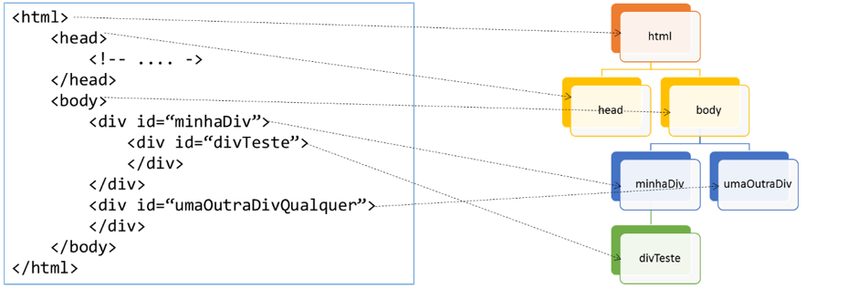
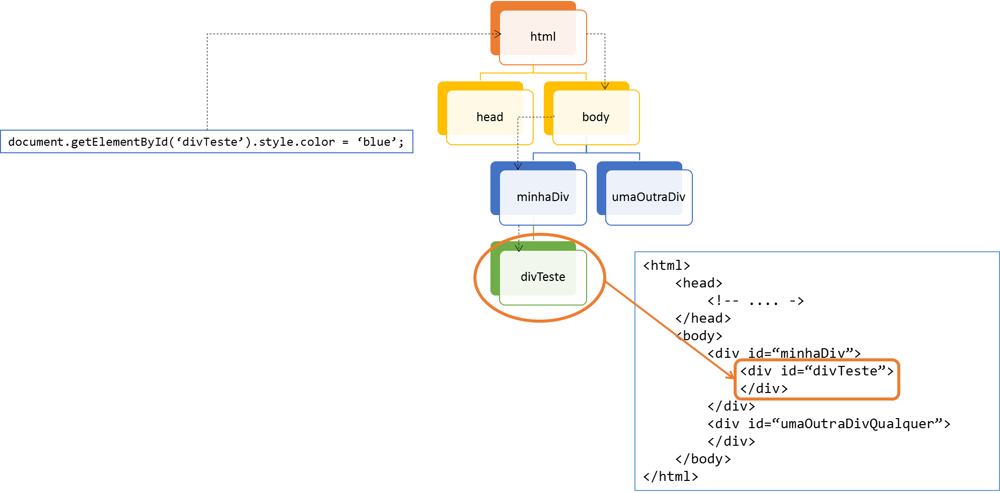

## O que é DOM e Virtual DOM?

O DOM (Document Object Model) é uma interface gerida pelos navegadores entre o HTML e o JavaScript. Quando você manipula um elemento HTML através de código JavaScript, ele acessa este elemento justamente através do DOM. É como se cada nó do DOM apontasse para o seu respectivo elemento HTML e o JavaScript, para evitar ficar realizando parse do HTML toda hora em que for necessária a manipulação de HTML, o representasse através desta estrutura virtual.

Repare no exemplo abaixo. Na ilustração, nós temos uma representação básica do que seria uma árvore DOM montada por um navegador qualquer.

Sendo assim, toda vez que um código JavaScript precisar acessar um elemento HTML, quer seja para realizar uma modificação ou mesmo somente verificar como está o estado atual do elemento, ele "navega" através da árvore DOM para encontrar o elemento e, após encontrá-lo na árvore DOM, ele consegue encontrar sua correspondência dentro do HTML.

Se quisermos deixar o HTML dinâmico, teremos que utilizar a árvore DOM para realizar as modificações necessárias nos elementos HTML. O problema é que o acesso e navegação dentro do DOM é muito lenta.

Para melhorar este aspecto, o React mantém uma cópia do DOM em memória, chamada de Virtual DOM. Quando algum dado é alterado e é necessária uma alteração na view (ou seja, no seu HTML), o React verifica pelo Virtual DOM quais as partes que devem ser alteradas. Com isso, ele acessa o DOM o menor número possível de vezes, alterando unicamente onde é necessário. Isso garante uma ótima velocidade às aplicações que utilizam a estratégia do Virtual DOM, como React e Vue.js.
