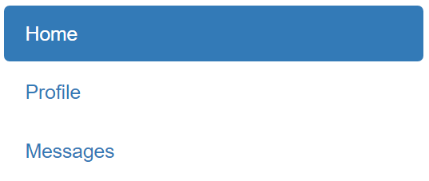

## O que é React?

O React é uma biblioteca desenvolvida pelo time do Facebook com o intuito de se aplicar o conceito de componentização durante o desenvolvimento de uma aplicação web. Isso quer dizer que, com o auxílio do React e do JavaScript, você poderá desenvolver componentes reutilizáveis na interface de sua aplicação web. Isso certamente acelera e facilita o trabalho que o desenvolvedor teria normalmente para desenvolver a interface da aplicação web.

Essa ideia de componentização na verdade não é nova. Ela já era usada há muitos anos no desenvolvimento de aplicações Desktop. Porém, no começo da Internet, o desenvolvimento Web era totalmente voltado a sites simples, criados para exibir informações estáticas.

O próprio Facebook define o React como sendo "uma biblioteca declarativa, eficiente e flexível baseada em JavaScript para construção de interfaces".

Como você pode reparar, o React se baseia na ideia de criarmos componentes que podem ser reutilizados em toda a aplicação e até em outras aplicações.

Veja a imagem acima. Ela apresenta um menu de navegação. Imagine criar um componente que contenha todo o código necessário para esse menu e, quando quisermos utilizá-lo, bastaria chamá-lo por uma tag criada por nós mesmos como "<MeuMenu />". Assim fica fácil reutilizá-lo onde quisermos, além da nossa View ficar mais limpa ao invés de várias 
 para todos os lados.

O React tem boa performance, pois evita acessar diretamente o DOM.

Como o objetivo do React é focar na criação de componentes, muitas funcionalidades ficam por conta dos desenvolvedores como: requisições, roteamento, internacionalização, etc.

Isso pode até parecer ruim, mas na verdade nos dá flexibilidade para integrar com qualquer biblioteca que quisermos.
