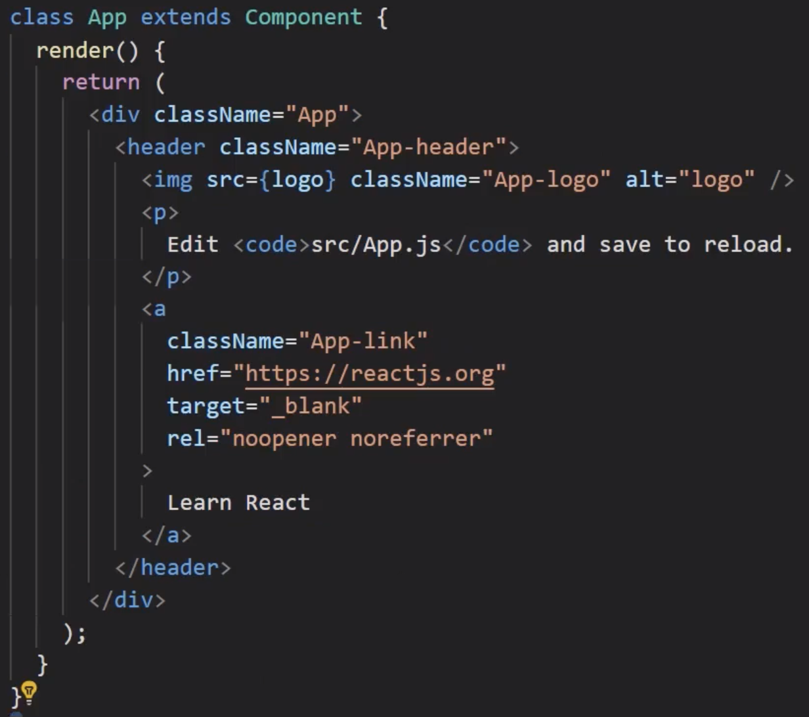
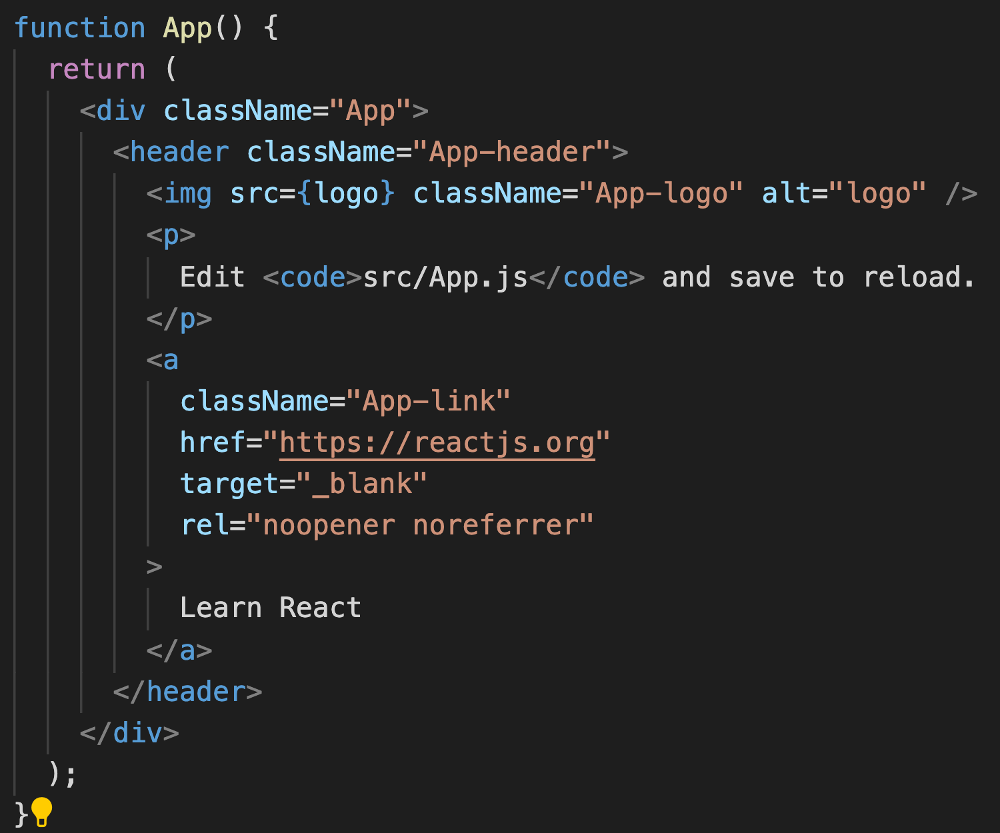

# Classes ou Funções?

No vídeo que acabamos de ver foi gerado um arquivo “App.js” com uma classe chamada App e um método “render()”:

Porém, se você seguiu os comandos da aula, na sua máquina foi gerada uma função como da imagem abaixo:

Isso acontece porque podemos criar componentes usando tanto classes quanto funções, e agora o React tem incentivado o uso de funções por causa de uma nova funcionalidade chamada de Hooks.

Não se preocupe com nada disso no momento, pois veremos sobre cada detalhe do React durante os cursos. Para entender cada parte dessa ferramenta tão poderosa, iremos nos focar nas classes. Depois sim teremos um curso inteiramente voltado para a criação de componentes com funções e a utilização dos Hooks.
